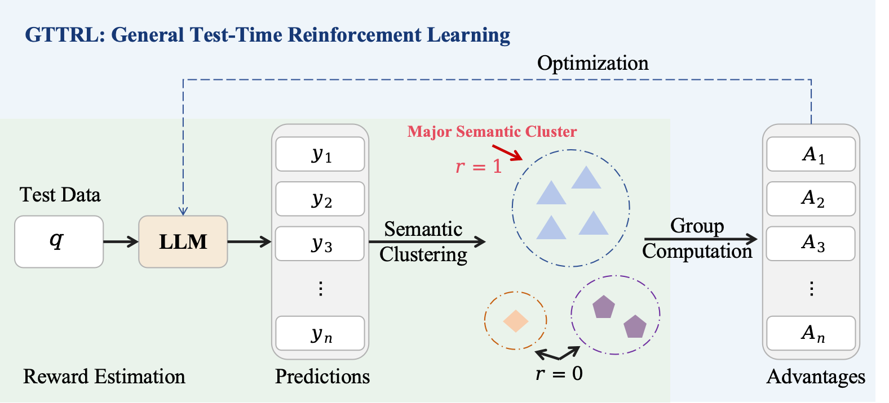
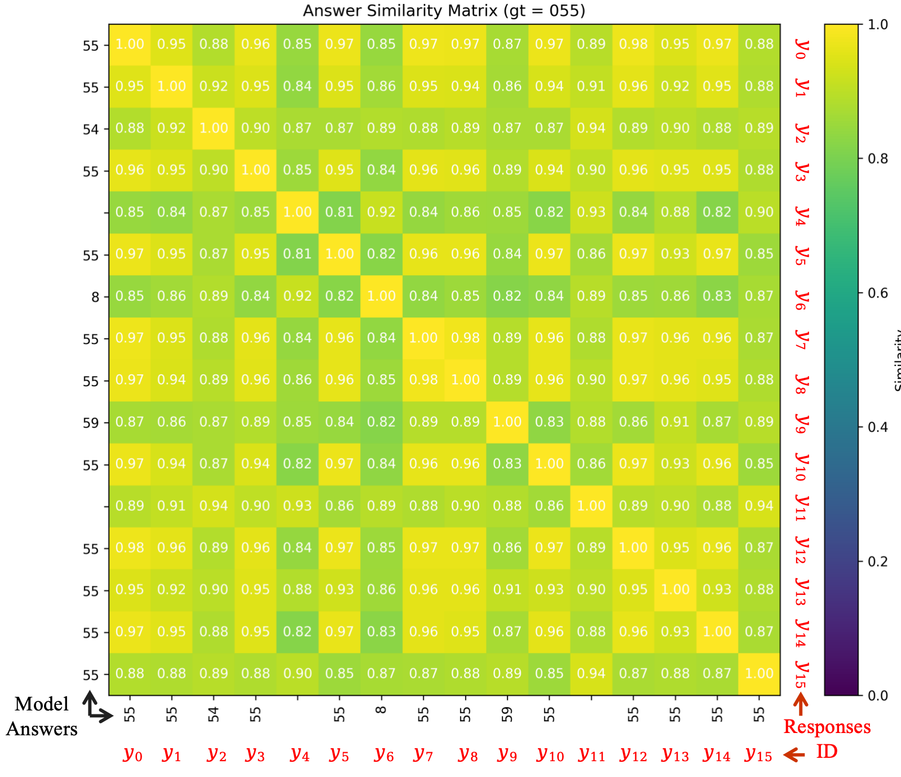
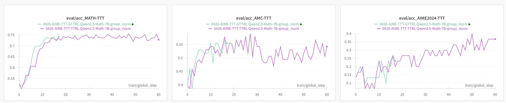

# GTTRL: General Test-Time Reinforcement Learning

# 🎉News

- **[2025-04-26]** We present **GTTRL** (General Test-Time Reinforcement Learning), an open-source general solution for online RL on data without ground-truth labels, especially test data.

  

# 📖Introduction

### Limitation of [Test-Time Reinforcement Learning](https://arxiv.org/abs/2504.16084)

[TTRL (Test-Time Reinforcement Learning)](https://arxiv.org/abs/2504.16084) uses Majority Voting to calculate rewards in reinforcement learning, which can significantly improve model performance in the absence of ground truth. However, in tasks such as code generation, it is not possible to calculate rewards through Majority Voting, which limits the application of the TTRL method to a broader range of tasks. Intuitively, if multiple responses yield the same answer to the same question, they should be semantically similar. Inspired by this, we pose the question: **Can Major Semantic Cluster replace Majority Voting to provide a more general method for reward calculation?**

### What is a Major Semantic Cluster?

A Semantic Cluster is a grouping where the texts within the cluster are semantically similar, while texts in different clusters have different semantics. In this paper, we use a clustering method based on semantic similarity to group different responses to the same question into different clusters based on their semantics. The cluster with the most texts is referred to as the Major Semantic Cluster.

Specifically, for the same question ( $q$ ), suppose there are multiple responses ($ y_1, y_2, \ldots, y_n$ ). We use an embedding model to get the semantic vectors of these responses, which can then form multiple Semantic Clusters based on their semantic similarity. Responses within the same cluster are semantically similar and are close to each other in vector space. Ultimately, we may obtain semantic clusters ($ C_1, C_2, \ldots, C_k$ ), where each cluster ( $C_j$ ) contains a set of semantically similar responses, and the cluster with the most elements is the major semantic cluster ( $C_{\text{m}}$ ).

### Can Major Semantic Cluster Replace Majority Voting?

To demonstrate that Major Semantic Cluster can partially replace majority voting in calculating rewards for reinforcement learning, we conduct preliminary experiments. For the same question ( $q$ ), we sample 16 responses using [DeepSeek-R1-Distill-Qwen-7B](https://huggingface.co/deepseek-ai/DeepSeek-R1-Distill-Qwen-7B) and compare the similarities and differences between the responses selected by majority voting and those selected by Semantic Clusters.

As shown in Figure above, for the question `Alice chooses a set $A$ of positive integers. Then Bob lists all finite nonempty sets $B$ of positive integers with the property that the maximum element of $B$ belongs to $A$. Bob's list has 2024 sets. Find the sum of the elements of A.`, we calculate the semantic similarity between different responses and use clustering algorithms to group semantically similar responses, resulting in the following five clusters: 

- [0, 1, 3, 5, 7, 8, 10, 12, 13, 14]     **（Major Semantic Cluster）**
- [4, 6]
- [11, 15]
- [2]
- [9]

We consider the responses in the **Major Semantic Cluster** as “correct responses.” Responses in other clusters are regarded as “incorrect responses.” Thus, we can obtain:

- **Correct Response**: $y_0, y_1, y_3, y_5, y_7, y_8, y_{10}, y_{12}, y_{13}, y_{14}$
- **Incorrect Response**: $y_2, y_4, y_6, y_9, y_{11}, y_{15}$

Through **Majority Voting**, we can obtain:

- **Correct Response**: $y_0, y_1, y_3, y_5, y_7, y_8, y_{10}, y_{12}, y_{13}, y_{14}, y_{15}$
- **Incorrect Response**: $y_2, y_4, y_6, y_9, y_{11}$

In fact:

- **Correct Response**: $y_0, y_1, y_3, y_5, y_7, y_8, y_{10}, y_{12}, y_{13}, y_{14}, y_{15}$
- **Incorrect Response**: $y_2, y_4, y_6, y_9, y_{11}$

Based on the above preliminary experiments, we observe that the **Major Semantic Cluster** can effectively identify a large portion of the correct responses, similar to majority voting. However, there are some differences in the results obtained by the two methods. Specifically, the Major Semantic Cluster method identified $y_{15}$ as an incorrect response, while majority voting classify it as correct. This discrepancy suggests that while Major Semantic Cluster can capture the essence of the correct responses through semantic similarity, it may sometimes exclude responses that are expressed in a unique or less common way.  In conclusion, the Major Semantic Cluster method shows promise in partially replacing majority voting.

> In our analysis, the above situation is not an isolated case; we will provide more cases and quantitative analysis.

# 📃Evaluation

The experiments are ongoing, but they have shown promising trends. The experimental settings are the same as [TTRL](https://arxiv.org/abs/2504.16084).

# ☑️TODO

- [ ] Clustering technique details.
- [ ] Extend to different types of tasks, such as code generation.

# 📨Contact

Hanbin Wang: [wanghanbin95@stu.pku.edu.cn](mailto:wanghanbin95@stu.pku.edu.cn)